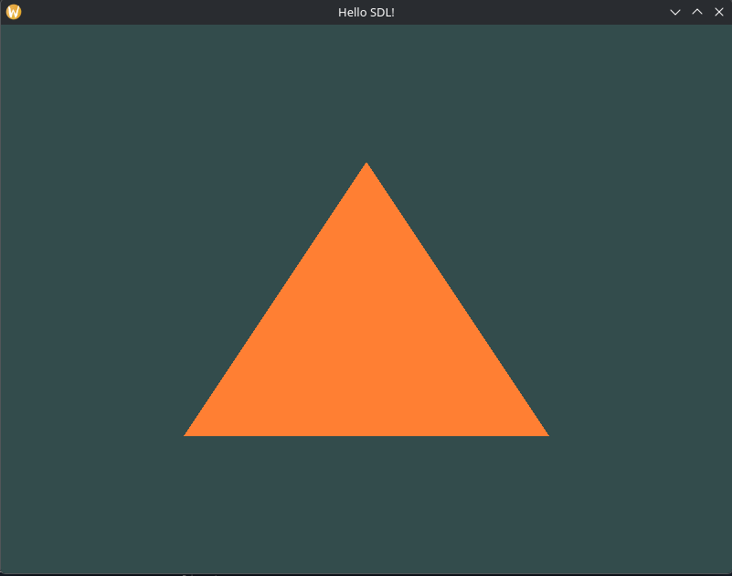
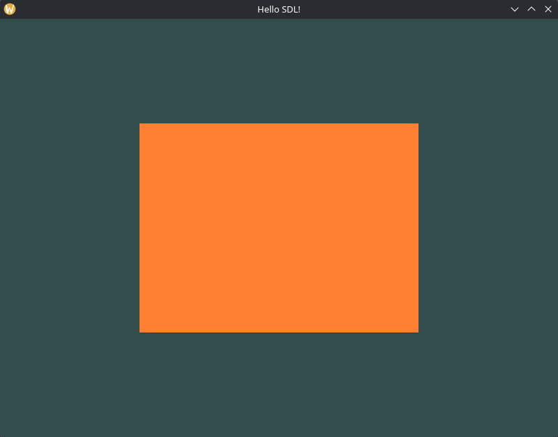
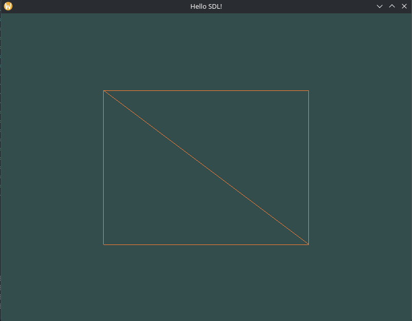
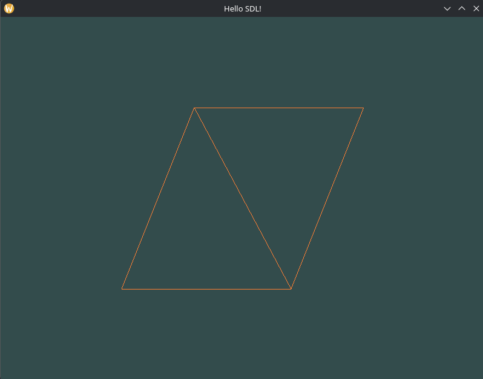
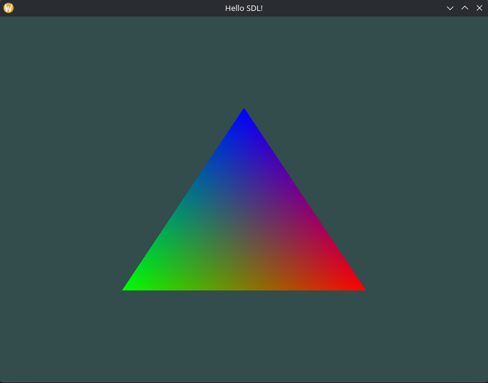

# Weeks 3-4
Decided to start jotting down progress on a day to day basis because putting the theory into my own words helps, and just because I want to.

### Monday
Was busy shopping and cooking today. So I decided to just read until reaching the point of writing code and return to that tomorrow.

Tutorial got into explaining the graphics pipeline. I've messed with shaders before but it was a sort of magic "black box" situation where I didn't really get the logic behind it. It's cool starting to wrap my head around the actual logic to it.

Some takeaways from what I read I wanted to write down.
- Early on it was stated OpenGL is like one big state machine which I am starting to get with the logic of OpenGL "hints" functionally being like state changes for handling different types of data.
- Similar to UV mapping, Bresenham's line algorithm, and some other assorted things I've worked with before. It seems there's a trend of normalizing vectors to represent handling arbitrary forms of distance. As in. Before being rasterized (mapped to pixels e.g. 1920x1080) data is often mapped on a scale of 0-1. Then due to math and algorithmic magic we can map these to pixels. I know this from the line algorithm which is how we get an array of pixels that lines up with a... line. I always wondered how mapping to different resolutions work and this seems to be related. You just pass a different number in and it adapts it.
- "Fragments" are OpenGLs term for pixels. Or rather the data related to drawing a pixel. There's a lot more in it then you'd think. Like lighting data. It's strange to think a 2d pixel needs that much data but it's interesting too. Also makes more sense as I read about the pipeline.
- Fragments can overlap. Despite being a 2d array of pixels they have a value for "depth" that determines whether to be discarded, or if transparency is involved, blended together. This has made me think about a lot of optimization stuff I've looked into before. A famous example is Minecraft improving performance with surface culling. Predicting surfaces that cannot possibly be seen and not rendering them to save time. Related here, in that I assume it would translate to not having to run the shaders on those pixels due to already knowing they cannot be rendered. From memory another technique is discarding surfaces that are facing away from the camera/viewport.
- In general, as I am super into video games, and animation, and modelling. Relating my other knowledge to this is actually quite fun to me. It's satisfying to understand the underlying logic behind things.

When I told my dad about my goal of a benchmark renderer he got excited about it with me and we talked about rendering tech for a bit. Also he offered to model a custom benchmark scene to test importing blender models. So that is now an addition I am wanting to add in.

One thing I have heard repeatedly is making the first triangle is the major hurdle. Well, the tutorial seems to be backing up these claims.

### Tuesday
Okay first thing I was right about the normalized coordinates thing. Also every single variant of this uses a different format. Opengl is on a scale of -1 to 1 with 0 at the center. Godot operated on 0 representing top left, and I recall Blender having 0 be bottom left. Not much standardization going on I see.

### Monday Again
Hey I drew a triangle, and even a rectangle! How impressive am I.

It reminds me of "Thomas Was Alone."

To review my learning in making these.

The OpenGL graphics pipeline is the multi-step process to turning 3d co-ordinates (vertex data) into pixels onscreen that makes an image. Through the steps programs called "shaders" configure the behaviour of a given step. On the dev's end this is mostly Vertex and Fragment shaders. Position and colour respectively.

Vertex data are points in space defined on an x/y/z axis. Three of these define a triangle which is what OpenGL relies on to draw shapes reliably. Though drawing lines and other things are possible, it's mostly triangles. See the rectangles made up of two triangles in screenshots above.

Shaders are programs that run on the GPU (Graphics Processing Unit). In short this matters because GPU's are tailor designed for drawing lots of triangles and lots of pixels. OpenGL is how we interface with the GPU to take advantage of this. Although this means it has some awkward rules like using VBOs (Vertex Buffer Objects) which can be a bit unintuitive.

VBOs are also our first contact with GL Objects. Sending data to the GPU from the CPU (where our code runs) is costly so we keep the data in the GPU, and in a GL Object. The variable to refer to these objects are actually number IDs. My understanding is that this CPU/GPU divide is what makes things more unintuitive then usual. VBOs store large amount of vertices in GPU memory. OpenGL also uses "targets", we have a set amount of OpenGL targets which we "bind" to an object ID. So all OpenGL functions using the target are directed towards the object in memory with that ID.

Shaders have different rules based on which part of the pipeline we're in. This makes obvious sense. But explains why I struggled with Shaders when I was just following tutorials in Godot. It's nice to understand things, that is all.

The shader is apparently where we would normalize co-ordinates and translate things into the -1 to 1 range but I guess that's a lesson for later because we're just doing normalized co-ordinates to begin with.

I had an error rendering the triangle and narrowed it down to the shaders. Basically I ran things in the wrong order. The way it seems to work is by creating objects following the rendering pipeline. Since I linked shaders out of order it didn't work. The output of one shader is the input to the other. Did fix it though.

This did end up feeling more esoteric compared to my other programming work. Was kinda of cool though, and satisfying to get working and wrap my head around. Hopefully it's true this is (one of) the hardest parts of OpenGL because I found it hard but very doable regardless.

### Tuesday Again
More shader stuff. I won't go over it because philosophically it's the same as what I've already talked about.

Though I've now reached the point where translating from C to C++ will actually be eventful since the tutorial is using Classes, which I ain't doing.

